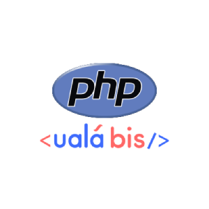

# ualabis-php

Official PHP SDK for Ualá Bis API Checkout

SDK PHP oficial de Ualá Bis API Checkout



## Content

- [Installation](#installation) | [Instalación](#instalación)
- [Functions](#functions) | [Funciones](#funciones)
- [Usage](#usage) | [Uso](#uso)
- [Test](#test) | [Prueba](#prueba)
- [API Checkout Docs](#api-checkout-docs)

## Installation

Install the package with:

```sh
composer require uala/ualabis-php
```

## Functions

List of all functions:

- createOrder
- getOrder
- getFailedNotifications

## Usage

Instantiate the Ualá Bis SDK class:

```php
<?php
  require_once('../vendor/autoload.php');

  use Uala\SDK;

  //if you want to test the sdk, set isDev w/ true value. FALSE by default if not specified
  $sdk = new SDK('your_username', 'your_client_id', 'your_client_secret_id', true);

  $order = $sdk->createOrder(11, 'test', 'https://www.google.com/', 'https://www.google.com/');
  $generatedOrder = $sdk->getOrder($order->uuid);

?>

```

## Test

We use PHPUnit and Mockoon to run internal mock API:

Install all dependencies from ```composer.json```:
```sh
composer install
```
Start mock API server:
```sh
npx mockoon-cli start --data ./tests/dataMockTest.json
```

or if you want to install it globally:
```sh
npm install -g @mockoon/cli
mockoon-cli start --data ./tests/dataMockTest.json
```
Run coverage:
```sh
composer coverage
```

We use ```XDebug``` for coverage report, is necessary to install it: [how to install Xdebug](https://xdebug.org/docs/install)


# Español

## Instalación

Instale el paquete con el siguiente comando:

```sh
composer require uala/ualabis-php
```

## Funciones

Listado de todas las funciones:

- createOrder
- getOrder
- getFailedNotifications

## Uso

Instancia la clase de Ualá Bis SDK:

```php
<?php
  require_once('../vendor/autoload.php');

  use Uala\SDK;
  
  //si queres probar el SDK, configura el valor isDev con valor true. Es false por defecto si no es especificado
  $sdk = new SDK('your_username', 'your_client_id', 'your_client_secret_id', true);

  $order = $sdk->createOrder(11, 'test', 'https://www.google.com/', 'https://www.google.com/');
  $generatedOrder = $sdk->getOrder($order->uuid);

?>
```

## Test

Usamos PHPUnit y Mockoon para correr un mock interno de una API:

Instala todas las dependencias de ```composer.json```:
```sh
composer install
```
Inicia la API mockeada:
```sh
npx mockoon-cli start --data ./tests/dataMockTest.json
```
o si queres instalarlo de forma global:
```sh
npm install -g @mockoon/cli
mockoon-cli start --data ./tests/dataMockTest.json
```
Ejecuta el coverage:
```sh
composer coverage
```

Usamos ```XDebug``` para los reportes de coverage, es necesario que lo instales: [cómo instalar Xdebug](https://xdebug.org/docs/install)


## API Checkout Docs

Also, you can show Api Checkout Documentation in https://developers.ualabis.com.ar
